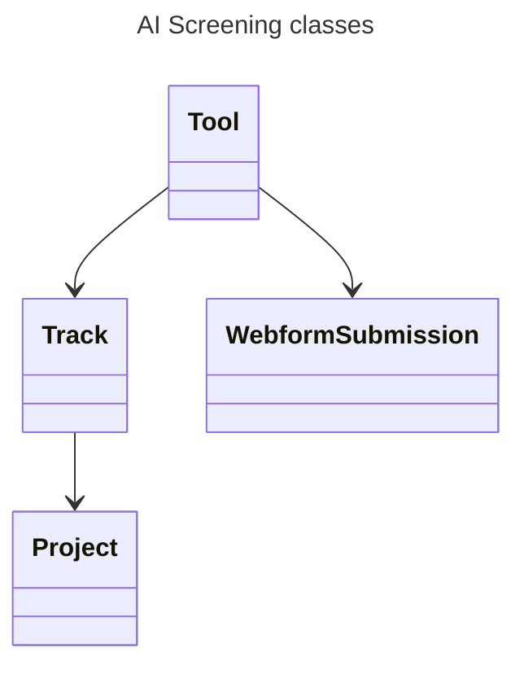

# AI Screening

[![Woodpecker](https://img.shields.io/badge/woodpecker-prod|stg-blue.svg?style=flat-square&logo=data:image/svg+xml;base64,PHN2ZyB4bWxucz0iaHR0cDovL3d3dy53My5vcmcvMjAwMC9zdmciIHdpZHRoPSIyMiIgaGVpZ2h0PSIyMiI+PHBhdGggZmlsbD0iI2ZmZiIgZD0iTTEuMjYzIDIuNzQ0QzIuNDEgMy44MzIgMi44NDUgNC45MzIgNC4xMTggNS4wOGwuMDM2LjAwN2MtLjU4OC42MDYtMS4wOSAxLjQwMi0xLjQ0MyAyLjQyMy0uMzggMS4wOTYtLjQ4OCAyLjI4NS0uNjE0IDMuNjU5LS4xOSAyLjA0Ni0uNDAxIDQuMzY0LTEuNTU2IDcuMjY5LTIuNDg2IDYuMjU4LTEuMTIgMTEuNjMuMzMyIDE3LjMxNy42NjQgMi42MDQgMS4zNDggNS4yOTcgMS42NDIgOC4xMDdhLjg1Ny44NTcgMCAwMC42MzMuNzQ0Ljg2Ljg2IDAgMDAuOTIyLS4zMjNjLjIyNy0uMzEzLjUyNC0uNzk3Ljg2LTEuNDI0Ljg0IDMuMzIzIDEuMzU1IDYuMTMgMS43ODMgOC42OTdhLjg2Ni44NjYgMCAwMDEuNTE3LjQxYzIuODgtMy40NjMgMy43NjMtOC42MzYgMi4xODQtMTIuNjc0LjQ1OS0yLjQzMyAxLjQwMi00LjQ1IDIuMzk4LTYuNTgzLjUzNi0xLjE1IDEuMDgtMi4zMTggMS41NS0zLjU2Ni4yMjgtLjA4NC41NjktLjMxNC43OS0uNDQxbDEuNzA3LS45ODEtLjI1NiAxLjA1MmEuODY0Ljg2NCAwIDAwMS42NzguNDA4bC42OC0yLjg1OCAxLjI4NS0yLjk1YS44NjMuODYzIDAgMTAtMS41ODEtLjY4N2wtMS4xNTIgMi42NjktMi4zODMgMS4zNzJhMTguOTcgMTguOTcgMCAwMC41MDgtMi45ODFjLjQzMi00Ljg2LS43MTgtOS4wNzQtMy4wNjYtMTEuMjY2LS4xNjMtLjE1Ny0uMjA4LS4yODEtLjI0Ny0uMjYuMDk1LS4xMi4yNDktLjI2LjM1OC0uMzc0IDIuMjgzLTEuNjkzIDYuMDQ3LS4xNDcgOC4zMTkuNzUuNTg5LjIzMi44NzYtLjMzNy4zMTYtLjY3LTEuOTUtMS4xNTMtNS45NDgtNC4xOTYtOC4xODgtNi4xOTMtLjMxMy0uMjc1LS41MjctLjYwNy0uODktLjkxM0M5LjgyNS41NTUgNC4wNzIgMy4wNTcgMS4zNTUgMi41NjljLS4xMDItLjAxOC0uMTY2LjEwMy0uMDkyLjE3NW0xMC45OCA1Ljg5OWMtLjA2IDEuMjQyLS42MDMgMS44LTEgMi4yMDgtLjIxNy4yMjQtLjQyNi40MzYtLjUyNC43MzgtLjIzNi43MTQuMDA4IDEuNTEuNjYgMi4xNDMgMS45NzQgMS44NCAyLjkyNSA1LjUyNyAyLjUzOCA5Ljg2LS4yOTEgMy4yODgtMS40NDggNS43NjMtMi42NzEgOC4zODUtMS4wMzEgMi4yMDctMi4wOTYgNC40ODktMi41NzcgNy4yNTlhLjg1My44NTMgMCAwMC4wNTYuNDhjMS4wMiAyLjQzNCAxLjEzNSA2LjE5Ny0uNjcyIDkuNDZhOTYuNTg2IDk2LjU4NiAwIDAwLTEuOTctOC43MTFjMS45NjQtNC40ODggNC4yMDMtMTEuNzUgMi45MTktMTcuNjY4LS4zMjUtMS40OTctMS4zMDQtMy4yNzYtMi4zODctNC4yMDctLjIwOC0uMTgtLjQwMi0uMjM3LS40OTUtLjE2Ny0uMDg0LjA2LS4xNTEuMjM4LS4wNjIuNDQ0LjU1IDEuMjY2Ljg3OSAyLjU5OSAxLjIyNiA0LjI3NiAxLjEyNSA1LjQ0My0uOTU2IDEyLjQ5LTIuODM1IDE2Ljc4MmwtLjExNi4yNTktLjQ1Ny45ODJjLS4zNTYtMi4wMTQtLjg1LTMuOTUtMS4zMy01Ljg0LTEuMzgtNS40MDYtMi42OC0xMC41MTUtLjQwMS0xNi4yNTQgMS4yNDctMy4xMzcgMS40ODMtNS42OTIgMS42NzItNy43NDYuMTE2LTEuMjYzLjIxNi0yLjM1NS41MjYtMy4yNTIuOTA1LTIuNjA1IDMuMDYyLTMuMTc4IDQuNzQ0LTIuODUyIDEuNjMyLjMxNiAzLjI0IDEuNTkzIDMuMTU2IDMuNDJ6bS0yLjg2OC42MmExLjE3NyAxLjE3NyAwIDEwLjczNi0yLjIzNiAxLjE3OCAxLjE3OCAwIDEwLS43MzYgMi4yMzd6Ii8+PC9zdmc+Cg==)](https://woodpecker.itkdev.dk/repos/20)
[](https://github.com/itk-dev/ai-screening/releases)
[](https://github.com/itk-dev/ai-screening/actions/workflows/pr.yaml)
[](https://codecov.io/gh/itk-dev/ai-screening)
[](https://github.com/itk-dev/ai-screening/commits/develop/)
[](https://github.com/itk-dev/ai-screening/blob/develop/LICENSE)

## Description

AI-screening is a Drupal project made to screen AI solutions. It screens in 3 categories "can we"
(complexity and uncertanty), "will we" (ethics) and "may we" (GDPR and AI act). The projects is
inatially based on the need to quickly, easy and using the same questions throughout the muncipality
to screen new AI projects. This is needed due to the speed AI projects develop and enter our work,
to make sure that the projects meets compliance and rules. Projects that clears the screening can
then move on to the next level of risk-handling, and more work being done to make sure that the
project can be used in the desired usecases.

Motivation for creating this project:

- need for screening of AI projects before they are used
- need for same screening done in the whole muncipality
- need for a way to communicate about the risks of taken in an AI project

### Concept

A _Project_ has one or more _Tracks_ each of which in turn has one or more _Tools_:



See [docs/Project.md](docs/Project.md) for some details on decisions made in the project.

## Setup

- Knowledge of Drupal is required for setting up this project.
- Knowledge of containerized applications is highly recommended.

### Default server setup

- Containerized environment through docker
  - See [docker-compose.yml](docker-compose.yml) and [docker-compose.server.yml](docker-compose.server.yml)
  - Ubuntu VMs with docker and docker compose installed.
- Running traefik globally installed on the server to
  - Manages incomming trafic: traefik -> nginx -> php
  - Handles SSL and certificates
- Domain is defined through use of environment variable: COMPOSE_SERVER_DOMAIN and used in traefik labels
- COMPOSE_PROJECT_NAME is also used and referenced in the docker-compose files
- A database container is defined in [docker-compose.yml](docker-compose.yml)
- Uses generic nginx and php images mapped from the local filessysteme
  - See [nginx.conf](.docker/nginx.conf) and [default.conf.template](.docker/templates/default.conf.template) for details

### Project setup

The project can for the most parts be maintained by use of console tools like
[drush](https://www.drush.org/13.x/) and [go tasks](https://taskfile.dev/)

- See [Taskfile.yml](Taskfile.yml) for questions about the install/build process
- See [woodpecker prod file](.woodpecker/prod.yml) for advise on actions to perform after updating.
Drupal manages site configuration in [web/sites/default/settings.php](web/sites/default/settings.php)
- The settings.php file looks for config and setting overrides in web/sites/default/settings.local.php
  - The settings.local.php file will likely contain sensitive information like db access and should not be publicly accessible
  - See [docs/Production.md](docs/Production.md) for examples of what this file could contain.

## Site installation

Run the following commands to set up the site a new. This will start containers
and run composer install, add a settings.php file and run site-install.

```shell name="site-up"
task site-install
```

When the installation is completed, that admin user is created and the password for logging in the outputted. If you
forget the password, use `drush user:login` command to get a one-time-login URL (note: the URI here only works if
you are using Traefik and [ITK-dev docker setup](https://github.com/itk-dev/devops_itkdev-docker)).

### Fixtures

To add fixtures to the site two tasks are provided.

> ### ! IMPORTANT
>
> Applying fixtures will delete all existing content on the site

```shell name="fixtures"
task apply-fixtures
```

Fixtures are grouped to allow only for certain fixtures to be loaded. The "base"
group holds only a minimum of content fixtures for the base functionality of the
site to work out of the box. Other fixtures add example content.

```shell name="fixtures-groups"
task apply-fixtures -- --groups=base,user
```

```shell name="site-login"
task drush -- user:login
```

See [ai_screening/README.md](web/modules/custom/ai_screening/README.md) for more settings.

## Updating the site

Run

``` shell name="site-update"
task site-update
```

to update the site.

### Access the site

If you are using out `itkdev-docker-compose` simple use the command below to åbne the site in you default browser.

```shell name="site-open"
open $(task site-url)
```

### Acces the admin

```shell name="site-open-admin"
task drush -- user:login
```

### Drupal config

Export config created from drupal:

```shell
task drush -- config:export
```

Import config from config files:

```shell
task drush -- config:import
```

### Coding standards

```shell name=coding-standards-composer
task compose -- exec phpfpm composer install
task compose -- exec phpfpm composer normalize
```

```shell name=coding-standards-php
docker compose exec phpfpm composer install
docker compose exec phpfpm composer coding-standards-apply/phpcs
docker compose exec phpfpm composer coding-standards-check/phpcs
```

```shell name=coding-standards-twig
docker compose exec phpfpm composer install
docker compose exec phpfpm composer coding-standards-apply/twig-cs-fixer
docker compose exec phpfpm composer coding-standards-check/twig-cs-fixer
```

```shell name=code-analysis
docker compose exec phpfpm composer install
docker compose exec phpfpm composer code-analysis
```

```shell name=coding-standards-markdown
docker run --rm --volume "$PWD:/md" itkdev/markdownlint $(git ls-files *.md) --fix
docker run --rm --volume "$PWD:/md" itkdev/markdownlint $(git ls-files *.md)
```

```shell name=coding-standards-markdown
docker run --rm --volume "$PWD:/md" itkdev/markdownlint $(git ls-files *.md) --fix
docker run --rm --volume "$PWD:/md" itkdev/markdownlint $(git ls-files *.md)
```

``` shell name=coding-standards-js
task prettier
```

## Site theme

There is a custom frontend theme installed with common components based on tailwind. See
[web/themes/custom/itkdev/itkdev_base_theme/README.md](web/themes/custom/itkdev/itkdev_base_theme/README.md) for details
on how to build and do development on the theme. TL;DR:

``` shell name="theme-build"
task theme-build
```

Build and watch for changes:

``` shell name="theme-watch"
task theme-watch
```

## Development

See [Development](docs/Development.md) for details on development.

## Production deployment

See [Production](docs/Production.md) for details on production deployment.
